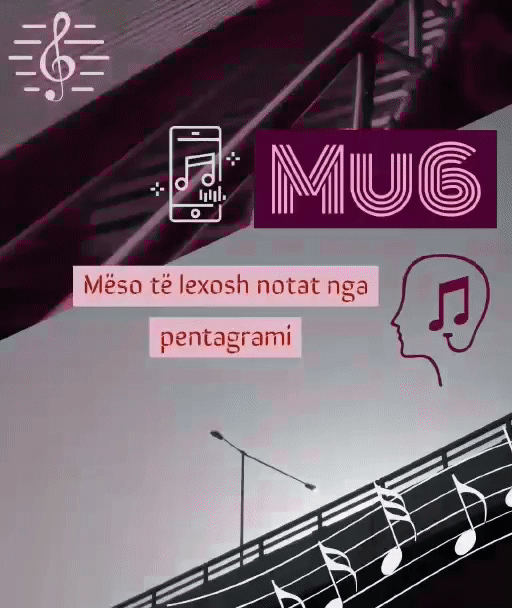
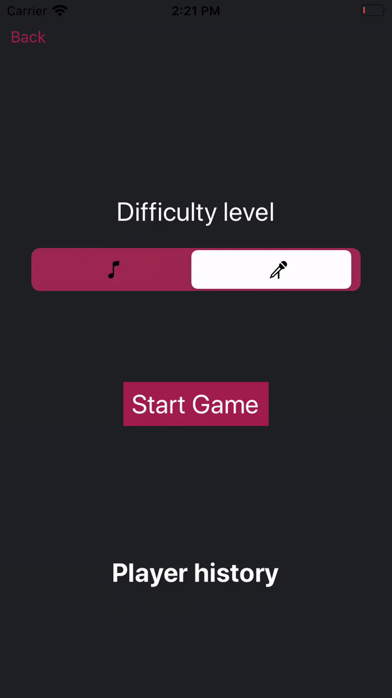
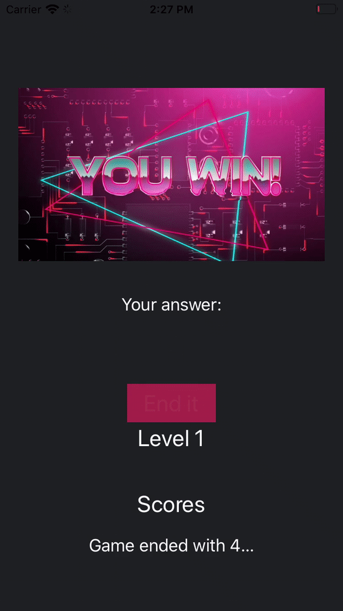
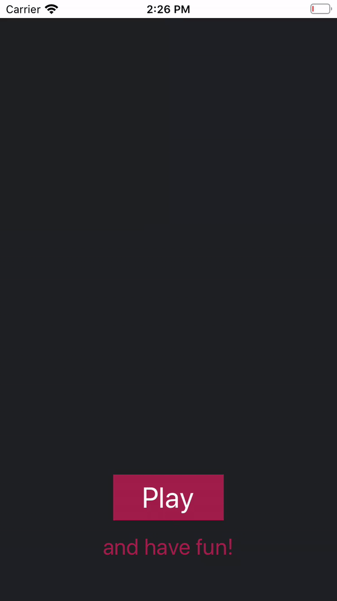
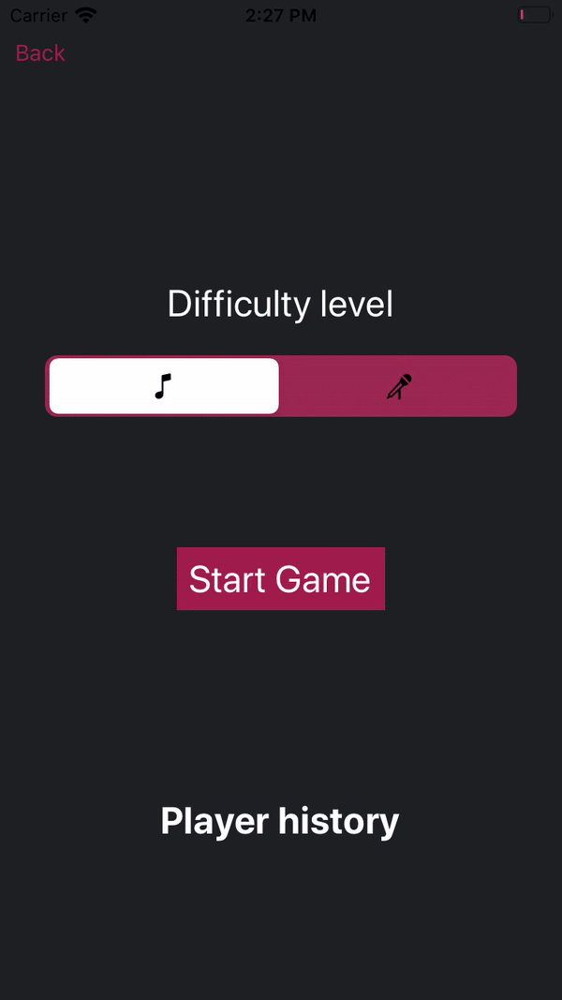
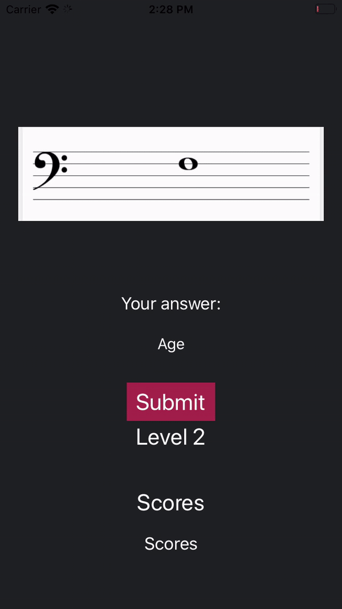

# Mu6

 

Keni nevojë që të mësoni leximin e notave muzikore në mënyrën e duhur...?!

Nuk jeni të sigurt se mënyra që ju po i lexoni ato është e duhura...?!

Atëherë, kjo është edhe ideja e aplikacionit tonë të quajtur Mu6, pra të ju ndihmojë në leximin e notave muzikore ashtu siq duhet, duke ua lehtësuar mësimin, dhe duke larguar dyshimet që ju i keni sa i përket saktësisë së leximit të këtyre notave.

Aplikacioni është i zhvilluar ashtu që të përdorë Speech Recognition në mënyrë që në bazë të saj të tregojë edhe saktësinë e leximit të notave muzikore.

## Teknologjitë e përdorura

- Xcode 10 for iOS
- Swift 5

## Kërkesat teknike të projektit

Aplikacioni duhet të:
- [x] Ketë më shumë se një view
    + Main Storyboard
        + Main View
        + Play View
        + Game View
    + History Storyboard
        + Scores View
        + Best Scores View
- [x] Mundësojë kalimin nga një view në tjetrën(at)
- [x] Përmbajë navigim
- [x] Ketë disa kontrolla dhe të mundësojë nderveprim me ta
- [x] Ketë një table view me custom row design
    + Scores View
    + ScoreCell
- [x] Ketë të paktën klasa(modele)
    + NoteModel
    + ScoreModel
- [x] Shfaq mesazhet e ndryshme si alert dialog
    + Description alert dialog
    + Play/Exit alert dialog
- [x] Ketë një databazë të brendshme
    + SQLite DBHandler
    
## Implementimi i kërkesave

|  |  |  |
| :---: | :---: | :---: |
| *Multiple Views dhe navigation* | *Kalimi nga një view në tjetrën*| *Segmented control* |

|  |  |  |
| :---: | :---: | :---: |
| *TableView dhe të dhënat nga db* | *Description dhe Play/Exit alertDialogs*| *Game dynamics* |

## Members

[Arbena Musa](https://github.com/ArbenaMusa)

[Medina Krelani](https://github.com/MedinaKrelani)